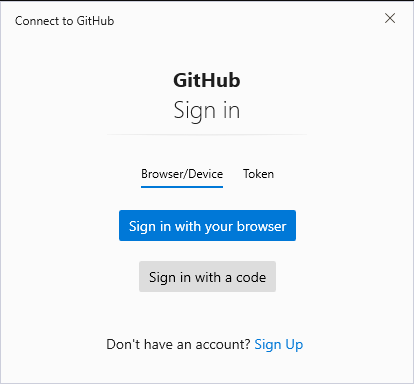

# Setting Up Your Computer For App Academy  

In order to be successful in the course, your computer needs to be setup in a very specific way. If the setup is correct, you will not waste your time fighting the setup of tools and applications, so you can concentrate on the new material you are learning.

***
***
<br>

# **1.** Installing the basics:

First we need to install a few simple things for all opperating systems.

 - [Google Chrome](https://www.google.com/chrome/)
 - [Visual Studio Code](https://code.visualstudio.com/download)  

***
<br>

# **2.** WSL (for Windows users only):  

## **If you are not using windows, please proceed to step 3.**  
<br>

In the Learning Challenges and Prep Work, you used **Git For Windows** which allowed you to use UNIX-style commands on your Windows machine. This approach allowed you to speed up the setup process and was sufficient for completing the Learning Challenges and Prep Work, but this approach is not sufficient for completing all of the practices and assessments for the course.  

Today we will be switching completely to WSL.

## Installing WSL:  

Future versions of Windows will include an automatic installer for WSL, but for now you will have to use the manual install instructions:  

- [Windows Subsystem for Linux Installation Guide for Windows 10 / 11](https://learn.microsoft.com/en-us/windows/wsl/install)

Follow this guide to install WSL 2 and Ubuntu Linux.    
  
# Tips for using WSL:

You will launch the **Ubuntu terminal** when the instructions in our curriculum tell you to open a Terminal.

**You should always store your code files in your Ubuntu home directory, and not in your Windows users home directory on your C: drive.** Many of the tools we use will perform better and be more stable if the files exist on the Ubuntu filesystem.

If you need to access the files in your Ubuntu home directory from Windows Explorer you can type `Windows + R` to bring up the run command dialog. Then type `\\wsl$\home\<your-user>` replacing `your-user` with your Ubuntu user name (you can find this out by typing `whoami` at your Ubuntu terminal prompt.)

If you want to access your Windows hard drive from Ubuntu you can use the path `/mnt/c` inside of the Ubuntu virtual machine. You should open project files in your Ubuntu files, not from your Windows files. Move project files from your Windows file system to your Ubuntu file system before opening and changing project files.

If you ever need to restart the Ubuntu virtual machine, you need to open a Powershell window and run the following command:

```
wsl --shutdown
```
Next time you open the Ubuntu terminal it will start the virtual machine back up.  

# Installing WSL Visual Studio Code extension:  

> Once you are finished setting up WSL, it is important to also install the extension for Visual Studio Code.  

### **To do so, please complete the following:**  
  - Open Visual Studio Code  
  - Find the Extensions tab on the left or by using the default shortcut (`Ctrl+Shift+X`)  
  - Search for WSL and click on the extension, it will be the one published by Microsoft  
  - Once found just click `install`  
  - Once completed you will now be able to open Visual Studio Code through your Ubuntu terminal using the command: 
  
  >  ```code .```  
  - Make sure to only run this inside your **Ubuntu Terminal**  

### **Git:**  

Git is a Version Control System, or VCS. It keeps track of a set of files over time, and is used through the command line.  
  - Return to your Ubuntu Terminal.
  - You need to configure Git, so type `git config --global user.name "Your Name"`, replacing "Your Name" with your real name.
  - Then type `git config --global user.email your@email.com`, replacing "your@email.com" with your real email.

Check that Git is installed and configured properly by typing the following commands into the Terminal. You should see your real name and real email address returned.  

```
git config --global user.name    # your name returned

git config --global user.email   # your email address returned
```  

***
<br>

# **3.** MacOS Configuration (mac users only):  

## **If you are not using mac, please proceed to step 4.**  
<br>

> *Note: You may have already completed this section during prepwork, if that is the case please proceed to step 4.*
<br>

### **Visual Studio Code:**  

Once you have installed Visual Studio Code please complete the following:  
  - Check that Visual Studio Code is installed and working properly by finding it in your Applications directory, and double-clicking to open it.  
  - To open the VS Code editor, open the Command Palette (`Cmd+Shift+P`) and type "shell command".  
  - Click on `Shell Command: Install 'code' command in PATH command`  
    - this will allow you to use the `code` command from the Terminal to open projects in VS Code.  

***
<br>

### **Homebrew:**  

Homebrew is a piece of software for macOS that lets you install extra unix software on your Mac.  
  - Select "Terminal" to start Terminal.
  - Open Safari and navigate to https://brew.sh.
  - Copy the command to be pasted into the Terminal by clicking on the clipboard icon.
  - Paste the command into Terminal and press Enter.
  - Press Enter when prompted.
  - Enter your password when prompted. Wait...this could take a long time!  

  You can check that Homebrew was installed correctly by typing `brew doctor` into the Terminal. If it reads that "Your system is ready to brew.", then you are done. If not, address the errors that you see. 
  
  > *If there are any warnings, you can ignore them for now and continue*.  

***  
<br>

### **Git:**  

Git is a Version Control System, or VCS. It keeps track of a set of files over time, and is used through the command line.  
  - Return to your Terminal.
  - Type `brew install git`.
  - You need to configure Git, so type `git config --global user.name "Your Name"`, replacing "Your Name" with your real name.
  - Then type `git config --global user.email your@email.com`, replacing "your@email.com" with your real email.
  - Finally, install xcode command line tools by typing xcode-select --install.  

Check that Git is installed and configured properly by typing the following commands into the Terminal. You should see your real name and real email address returned.  

```
git config --global user.name    # your name returned

git config --global user.email   # your email address returned
```  

***
<br>

# **4.** Configuring Default Git Branch:

Now, you will complete some further configuration that will help you to start integrating Git with GitHub.

First, enter the following command in your Mac or Windows terminal:

```
git config --global init.defaultBranch main
```

This specifies that your default Git branch should be the `main` branch.

***
<br>

# **5.** Installing NVM / NodeJS / Mocha:  

Follow the instructions below for installing Node.js for your Mac or Windows environment:  

### **NVM:**
<br>

**For all users copy the command below and paste it in either your Terminal (mac) or Ubuntu Terminal (windows):**  

```
curl -o- https://raw.githubusercontent.com/nvm-sh/nvm/v0.39.3/install.sh | bash
```

Press enter, and you'll see a lot of information logged:  

```
 ... a lot of information logged

=> Appending nvm source string to /home/your-user/.bashrc
=> Appending bash_completion source string to /home/your-user/.bashrc
=> Close and reopen your terminal to start using nvm or run the following to use it now:

# ... this is the important part below
export NVM_DIR="$HOME/.nvm"
[ -s "$NVM_DIR/nvm.sh" ] && \. "$NVM_DIR/nvm.sh"  # This loads nvm
[ -s "$NVM_DIR/bash_completion" ] && \. "$NVM_DIR/bash_completion"  # This loads nvm bash_completion
```

Once the command has finished, close your terminal and re-open it for the changes to take effect.  

### **NodeJS:**  
<br>

After you have re-opened your terminal enter the following command:  

```
nvm install 16
```

You should see something like this:

```
Downloading and installing node v16.14.0...
Downloading https://nodejs.org/dist/v16.14.0/node-v16.14.0-darwin-arm64.tar.xz...
######################################################################### 100.0%
Computing checksum with shasum -a 256
Checksums matched!
Now using node v16.14.0 (npm v8.3.1)
Creating default alias: default -> 16 (-> v16.14.0)
```

You'll see that Node has automatically installed the latest version of `16` for you.

Once this is complete, you should be able to type:

```
node --version
```

and it should print out the correct version of Node.JS.

You can verify that the Node.JS you installed is coming from your `nvm` setup, by using this shell command:

```
which node
```

If it prints out a path with `.nvm` in it, then you've done it correctly!

```
/home/<<your username>>/.nvm/versions/node/v16.14.0/bin/node
```

### **Mocha:**  
<br>

As a developer, testing your code before it reaches any sort of live environment is critical to ensuring that problems don't occur for end users.

Unit tests are tests designed to test the smallest piece of code that can be logically isolated. This usually includes any functions, methods, and properties that you write to ensure that they behave in the way you intended.

For now, you will not have to write your own tests, but you will have to run the tests written for you.

To install Mocha, you will use the npm command.

> *NOTE: DO NOT confuse npm with nvm. They are different tools. nvm controls the version of Node.JS you have installed, while npm is responsible for installing Node Packages which are third party pieces of software written in JavaScript.*

To install mocha, enter the following command into your Terminal (mac) or Ubuntu terminal (windows):

```
npm install -g mocha
```

The `-g` is called a flag. This changes the behavior of the install command.

In this case it means `global`. By default, `npm` will install files into your project directory. We want mocha to be installed for all projects, so we specify `-g`.

You can verify mocha works by typing

```
mocha --version
```

If it prints out a version number, pat yourself on the back, you have successfully installed Node.JS and Mocha!

***
<br>

# **6.** Setting up authentication for Github:  

### **Configuring GitHub Authentication**
<br>

Because GitHub allows you to share code with other developers, there needs to be a way to authenticate to make sure that you are authorized to access or contribute new code.

Thankfully, git handles this authentication flow automatically. But for GitHub, there are several options for handling this authentication. These instructions will walk you through setting up authentication through Git Credential Manager, which is App Academy's preferred method.

<br>

> *Note: If you have never configured GitHub authentication before, follow the instructions below to set up Git Credential Manager. If you already have authentication set up using a PAT or SSH key, you may continue using that approach. You can reference this [SSH article](https://hackmd.io/@AgDXdHgSSPKsJIhCxlaTuA/BJtNu88fF) or [PAT article](https://github.com/appacademy/practice-for-SETUP-swe-online-setup/blob/main/setup-resources/setting-up-pat.md) for troubleshooting your existing setup if needed.*

<br>

### **Git Credential Manager:**  

[Git Credential Manager](https://github.com/GitCredentialManager/git-credential-manager) is the recommended secrets manager for GitHub authentication for Windows, Mac, and Linux.  

<br>

### **Windows:**  
<br>

If you followed the setup instructions for the Learning Challenges and installed Git for Windows, you will already have Git Credential Manager installed and ready to go.

If you did not install Git Credential Manager through Git for Windows, follow the more detailed instructions in the [Git Credential Manager Setup](https://github.com/appacademy/practice-for-SETUP-swe-online-setup/setup-resources/git-credential-manager.md) article.

If you are already using WSL, run the following command in your `Ubuntu terminal` to tell git to use Windows Credential Manager. 

```
git config --global credential.helper "/mnt/c/Program\ Files/Git/mingw64/bin/git-credential-manager-core.exe"

```

<br>

### **Mac:**
<br>

To install Git Credential Manager on Mac, you will use `Homebrew`. Open your `Terminal`, and run the following two commands:

```
brew tap microsoft/git

brew install --cask git-credential-manager-core
```

<br>

### **Testing Git Credential Manager (Windows and Mac):**
<br>

Once Git Credential Manager is set up, you need to **restart your terminal**.

You can test to make sure GCM is working by attempting to clone or push to a private repository. When you do this, you should get prompted by a new Window to enter your GitHub credentials.



Choose "Browser/Device" and click "Sign in with your browser". You will then need to enter your GitHub username and password. Upon providing your credentials, your terminal should report it's success with the given operation.

Once you have completed the above, you should have github authentication all set up!  

### **Cloning a Repository (Windows and Mac):**  
<br>

**Clone Module 1 resources:**
  - Open Google Chrome (or any browser you use)
  - Navigate to the [Module 1 resources repo](https://github.com/appacademy/Module-1-Resources)
  - Click on the green `Code` button
  - In the drop down make sure to select the `HTTPS` tab and copy the link

Go ahead and run the following command in your Terminal (mac) Ubuntu terminal (windows):  

```
git clone https://github.com/appacademy/Module-1-Resources.git
```

After running the above command you should see something like the following:  

```
Cloning into 'Module-1-Resources'...
remote: Enumerating objects: 7933, done.
remote: Counting objects: 100% (73/73), done.
remote: Compressing objects: 100% (64/64), done.
remote: Total 7933 (delta 25), reused 55 (delta 9), pack-reused 7860
Receiving objects: 100% (7933/7933), 7.64 MiB | 7.45 MiB/s, done.
Resolving deltas: 100% (3443/3443), done. 
```

**If you managed to clone Module 1 Resources, then congratulations!**

**You have completed tech setup!**